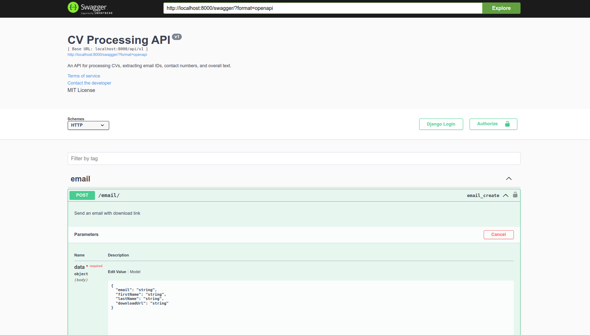
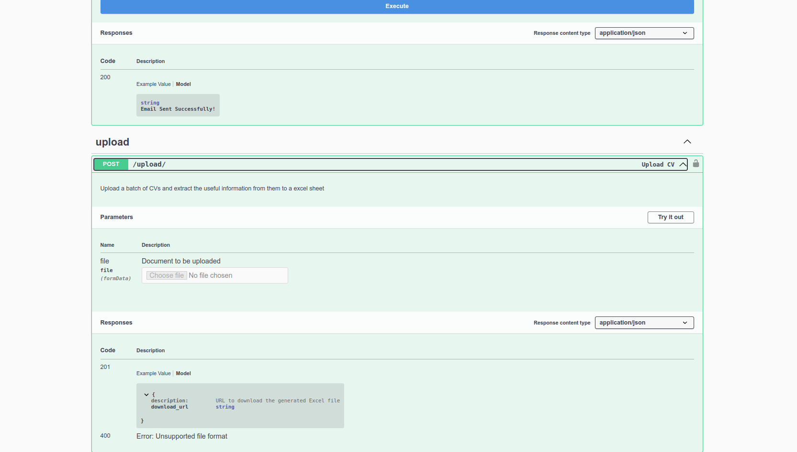
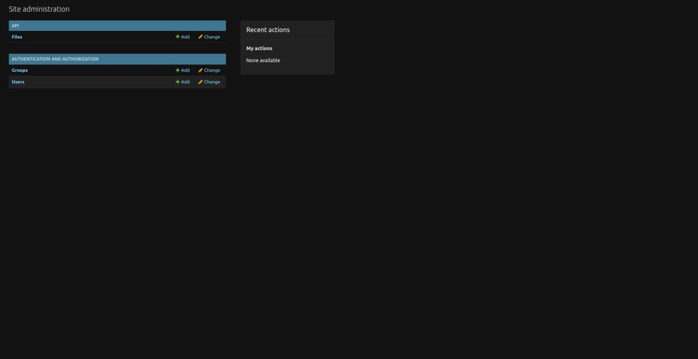
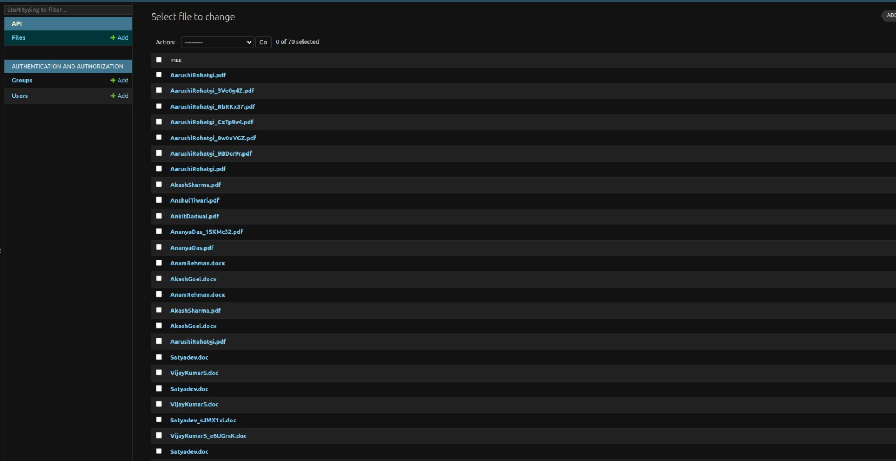

# OST Backend

This project serves as the backend logic for extracting email IDs, contact numbers, and overall text from CVs. It provides an API endpoint for uploading CV files, processing them, and downloading the extracted data in .XLS format.

| Label                | Image URL                                               |
|----------------------|---------------------------------------------------------|
| Swagger Image 1      |                      |
| Swagger Image 2      |                      |
| Django Landing Page  |     |
| File Model Page Admin|  |

## Installation

1. Clone the repository:

   ```bash
   git clone https://github.com/AnkitJain78/OST_Backend.git
   ```

2. Navigate to the project directory:

   ```bash
   cd OST_Backend
   ```

3. Install dependencies:

   ```bash
   pip install -r requirements.txt
   ```

4. Set up any necessary environment variables (if applicable).

## Usage

1. Start the server:

   ```bash
   python3 manage.py runserver
   ```

2. Once the server is running, you can access the API endpoints.

### API Endpoints

- **POST /api/v1/upload**: Upload a CV file or multiple files for processing.
- **Docs /swagger/**: Swagger Docs

## Data Extraction

- **Email IDs**: Extracted using regular expressions to match common email patterns.
- **Contact Numbers**: Extracted using regular expressions to match common phone number patterns.
- **Overall Text**: The entire text content of the CV is extracted.

## Contributing

Contributions are welcome! Feel free to open issues or pull requests for any improvements or fixes.

## License

This project is licensed under the MIT License - see the [LICENSE](LICENSE) file for details.
